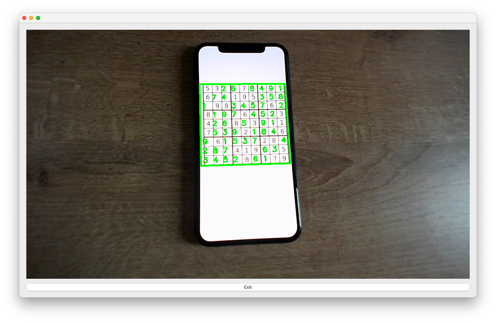
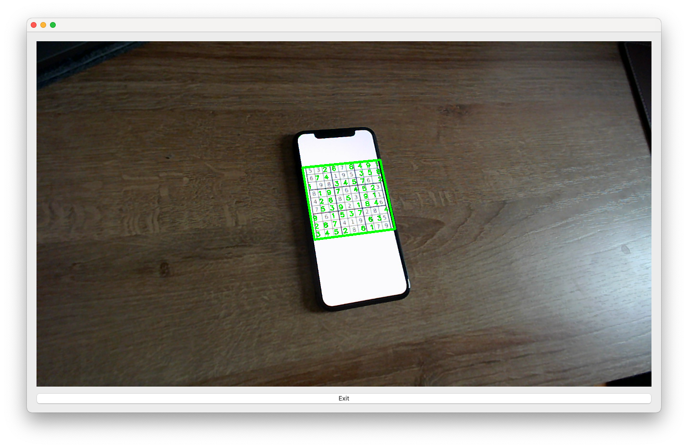
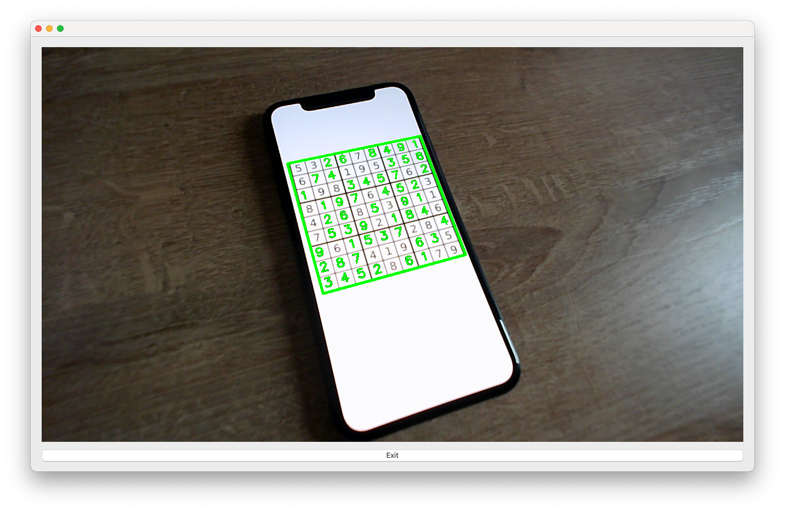
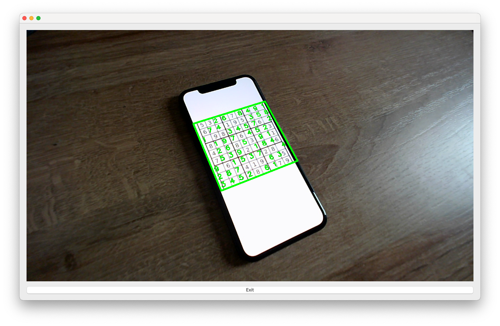

# sudoku-solver
An image based sudoku solver which is able to solve printed sudokus with a trained digit recognition model. The solved sudoku gets overlapped with the input image and displayed in a simple desktop application. As input, the video stream of the web-cam is used. 
## how to start
- install the following python packages:
  - `pip install numpy`
  - `pip install tensorflow`
  - `pip install keras`
  - `pip install PyQt5`
  - `pip install opencv-python`
- navigate into the `sudoku_lib` directory and compile the cython file: `cythonize -i sudoku_cython.pyx`
- contact us to get the trained model for the number recognition

## some impressions

## dev-team
- Michael Neuhold
- Julian Jany
- Gerald Mitterecker
